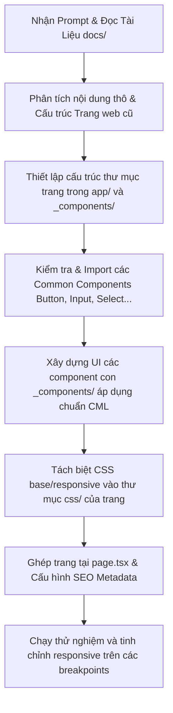

# Hướng Dẫn Nâng Cấp Giao Diện (UI Upgrade) Từ URL Cho WebCore

Tài liệu này hướng dẫn chi tiết quy trình chuẩn bị và cách viết prompt cho AI Assistant khi bạn muốn clone/nâng cấp giao diện của một trang web có sẵn (từ một đường dẫn URL) vào dự án **WebCore**, đảm bảo **giữ nguyên 100% nội dung (content)** và **nâng cấp giao diện (UI/UX) lên mức premium, hiện đại**.

---

## I. Quy Trình Chuẩn Bị (Preparation Checklist)

Trước khi bắt đầu prompt cho AI, bạn cần chuẩn bị đầy đủ các thông tin và tài nguyên sau để đảm bảo AI hoạt động chính xác nhất:

### 1. Phân Tích & Trích Xuất Nội Dung (Content Extraction)

Để đảm bảo không bị sai lệch hoặc mất mát thông tin, hãy thu thập:

- **Text & Copywriting**: Copy toàn bộ nội dung text trên trang web gốc (Tiêu đề, mô tả, các nhãn nút bấm, câu chữ cam kết, thông số kỹ thuật...). Bạn nên lưu tạm ra một file markdown hoặc text thô.
- **Form Fields**: Ghi nhận các trường nhập liệu (Input, Select, Checkbox, Radio) cùng với các placeholder và label tương ứng.
- **Menu/Navigation**: Cấu trúc menu trên header hoặc footer của trang web gốc.

### 2. Trích Xuất & Chuẩn Bị Tài Nguyên (Assets)

- **Logo & Icons**: Tải các file Logo dạng SVG. Nếu là SVG React Component, hãy đặt vào `src/components/icons/`. Nếu là SVG tĩnh không cần đổi màu, hãy lưu vào `src/assets/icons/`.
- **Hình ảnh (Images)**: Tải các hình ảnh từ trang web cũ và lưu vào [src/assets/images/](file:///d:/GlobalSafe/web-core/src/assets/images/).
  - _Mẹo_: Nếu muốn nâng cấp chất lượng hình ảnh, hãy mô tả định hướng hình ảnh để AI tự sinh qua công cụ generate_image hoặc sử dụng các hình ảnh có sẵn sang xịn mịn hơn.
- **Fonts**: Xác định font chữ của trang gốc hoặc chọn một font chữ sang trọng từ Google Fonts (như _Inter_, _Outfit_, _Roboto_, _Plus Jakarta Sans_) để tích hợp vào WebCore.

### 3. Đối Chiếu Hệ Thống Component Có Sẵn (Core Mapping)

Xem xét các component có sẵn trong WebCore để tái sử dụng, tránh viết lại từ đầu:

- Các Common Components có sẵn tại [src/components/common/](file:///d:/GlobalSafe/web-core/src/components/common/) (ví dụ: `Button`, `Input`, `Select`, `Radio`, `Textarea`, `Skeleton`).
- Các Radix/Shadcn Components tại [src/components/ui/](file:///d:/GlobalSafe/web-core/src/components/ui/) (nếu thiếu, hãy cài thêm thông qua `npx shadcn@latest add <component-name>`).

---

## II. Cách Viết Prompt Cho AI (AI Prompt Template)

Dưới đây là khung Prompt chuẩn hóa (Prompt Template) mà bạn có thể copy và điền thông tin để ra lệnh cho AI. Prompt này được thiết kế để ép AI tuân thủ nghiêm ngặt cấu trúc thư mục, quy tắc CML, viết CSS Responsive cô lập và giữ đúng nội dung của bạn.

```markdown
### VAI TRÒ & NHIỆM VỤ

Bạn là một lập trình viên React/Next.js xuất sắc và là một Chuyên gia Thiết kế UI/UX cao cấp (Creative Frontend Engineer).
Nhiệm vụ của bạn là xây dựng lại trang [Tên Trang, ví dụ: Login / Landing Page] cho dự án WebCore dựa trên nội dung của trang web gốc từ URL: [Dán URL của trang gốc vào đây].

YÊU CẦU CỐT LÕI:

1. ĐÚNG CONTENT: Giữ nguyên 100% nội dung chữ, cấu trúc thông tin, nhãn nút bấm, placeholder từ trang gốc. Tuyệt đối không tự ý bịa đặt hoặc lược bỏ nội dung copywriting trừ khi được yêu cầu.
2. NÂNG CẤP UI/UX: Thay đổi hoàn toàn phong cách thiết kế cũ bằng một giao diện hiện đại, cao cấp (Premium, Sleek, Futuristic Dark-tech hoặc Elegant Light Mode).
   - Sử dụng HSL tailored colors (tránh dùng màu cơ bản thô).
   - Thiết kế khoảng trắng rộng rãi (section spacing py-20, gap-8).
   - Bo góc mềm mại (rounded-2xl hoặc rounded-3xl cho card/container).
   - Đổ bóng mịn màng (border border-slate-100/80 kết hợp shadow-sm).
   - Thêm hiệu ứng hover, transition mượt mà (transition-all duration-300).

---

### TÀI LIỆU QUY CHUẨN CẦN TUÂN THỦ

Trước khi viết code, bạn BẮT BUỘC phải đọc kỹ và tuân thủ các quy chuẩn dự án sau:

1. Quy chuẩn kiến trúc & cấu trúc thư mục: Xem tại [WebCoreConvention.md](file:///d:/GlobalSafe/web-core/docs/WebCoreConvention.md)
2. Quy chuẩn Common Component & Style Override: Xem tại [workflow.md](file:///d:/GlobalSafe/web-core/docs/workflow.md)

---

### HƯỚNG DẪN KỸ THUẬT CHI TIẾT

1. CẤU TRÚC THƯ MỤC:
   - Tạo trang mới tại: `src/app/[locale]/[tên-trang-bằng-kebab-case]/page.tsx` (Phải là Server Component).
   - Tạo thư mục các component con nội bộ của trang tại: `src/app/[locale]/[tên-trang-bằng-kebab-case]/_components/` (Ví dụ: `HeroSection.tsx`, `FeatureGrid.tsx`).
   - Tạo thư mục style responsive cô lập tại: `src/app/[locale]/[tên-trang-bằng-kebab-case]/css/`.

2. QUẢN LÝ STYLE VÀ RESPONSIVE:
   - Sử dụng Tailwind CSS v4 kết hợp Semantic ClassName (đặt ở cuối chuỗi className).
   - Tạo file `[tên-trang].responsive.css` trong thư mục `css/` để viết media query responsive theo bảng Breakpoints chuẩn trong WebCoreConvention.md.
   - Nhập file CSS này vào `page.tsx` hoặc tạo file `index.responsive.css` để import tập trung. Không lạm dụng tiền tố `md:`, `lg:` trực tiếp trong JSX nếu làm layout responsive phức tạp.

3. SỬ DỤNG COMMON COMPONENTS:
   - Sử dụng các component dùng chung tại `src/components/common/` như `Button` và `Input` thay vì tự viết tag `<button>` hoặc `<input>` thô.
   - Đọc kỹ props của các common component này trong [workflow.md](file:///d:/GlobalSafe/web-core/docs/workflow.md).

4. QUY TẮC COMMENT LAYOUT (CML):
   - Viết code component tuân thủ đúng thứ tự Comment Layout:
     // Hooks
     // States
     // Constants & Memos
     // Effects
     // Handlers
     return (...)

5. TÀI NGUYÊN HÌNH ẢNH:
   - Sử dụng hình ảnh tĩnh từ thư mục [src/assets/images/](file:///d:/GlobalSafe/web-core/src/assets/images/).
   - Nếu cần icon, hãy sử dụng thư viện icon có sẵn trong dự án hoặc Radix/Lucide React Icons.

---

### DỮ LIỆU NỘI DUNG NGUỒN (ORIGINAL CONTENT)

[Dán nội dung text thô, cấu trúc thông tin của trang gốc mà bạn đã chuẩn bị ở Bước 1 vào đây]

---

### ĐỊNH HƯỚNG PHONG CÁCH THIẾT KẾ MỚI (NEW DESIGN DIRECTION)

- Style: [Chọn style mong muốn, ví dụ: Dark Mode tối giản phong cách Linear/Stripe, Glassmorphism, hoặc Bento Grid hiện đại].
- Font chữ chủ đạo: [Ví dụ: Outfit hoặc Inter].
- Tông màu chủ đạo: [Ví dụ: Emerald làm điểm nhấn trên nền Zinc/Slate đen sâu].
- Các hiệu ứng đặc biệt: [Ví dụ: Glow border khi hover, smooth scroll, fade-in animation].

Hãy bắt đầu phân tích cấu trúc, thiết lập các file cần thiết và triển khai mã nguồn theo đúng các bước quy định.
```

---

## III. Quy Trình Phân Tích & Triển Khai Của AI (Execution Flow)

Khi AI nhận được prompt trên, quy trình thực thi chuẩn sẽ diễn ra như sau:



### Chi tiết các bước triển khai trong mã nguồn:

#### Bước 1: Tạo Page chứa Layout & SEO (`page.tsx`)

Tại [src/app/[locale]/[tên-trang]/page.tsx](file:///d:/GlobalSafe/web-core/src/app/[locale]/[tên-trang]/page.tsx):

- Khai báo metadata cho trang để tối ưu SEO.
- Import file CSS responsive đại diện.
- Gọi dữ liệu từ Server (nếu có) và render các component con từ thư mục `_components/`.

#### Bước 2: Tạo các Section Component trong `_components/`

Các section được tách ra để dễ bảo trì, ví dụ:

- `src/app/[locale]/[tên-trang]/_components/Header.tsx`
- `src/app/[locale]/[tên-trang]/_components/Hero.tsx`
- Tuân thủ cấu trúc CML nghiêm ngặt.

#### Bước 3: Định nghĩa CSS Responsive độc lập

Tại `css/` của trang:

- Viết các animation tùy chỉnh hoặc thuộc tính nâng cao trong `[tên-trang].base.css`.
- Viết `@media` query tối ưu layout theo chuẩn thiết bị trong `[tên-trang].responsive.css`.

---

## IV. Ví Dụ Minh Họa (Case Study)

Giả sử bạn muốn nâng cấp một trang **Đăng Ký Tài Khoản (Register Page)** từ URL cũ:

- **Nội dung gốc có**: Tiêu đề "Đăng ký thành viên", các ô nhập (Họ tên, Email, Mật khẩu, Số điện thoại), nút "Đăng ký ngay", link "Đã có tài khoản? Đăng nhập".
- **Giao diện cũ**: Nền trắng đơn giản, các input có viền xám thô, nút bấm vuông màu xanh lam nhạt.
- **Mục tiêu UI mới**: Nền tối sâu (Deep Slate dark mode), card đăng ký dạng kính mờ (Glassmorphism), input bo góc `rounded-xl` màu viền ngọc lục bảo (Emerald) phát sáng nhẹ khi focus, nút bấm có hiệu ứng gradient kèm hiệu ứng zoom-in nhẹ khi di chuột qua.

### Cách triển khai cấu trúc thư mục của AI:

```text
src/app/[locale]/register/
├── page.tsx                       # Gọi RegisterForm và định nghĩa SEO
├── _components/
│   └── RegisterForm.tsx           # Form xử lý, dùng Input & Button common
└── css/
    ├── register.base.css          # Định nghĩa Glassmorphism & Glow border
    └── register.responsive.css    # Responsive padding/layout trên mobile & tablet
```

### Code mẫu `RegisterForm.tsx` áp dụng CML & Common Components:

```tsx
"use client";

import { useState, useCallback } from "react";
import { Input } from "@/components/common/Input";
import { Button } from "@/components/common/Button";
import { toast } from "sonner";
import "../css/register.base.css";
import "../css/register.responsive.css";

export function RegisterForm() {
  // Hooks

  // States
  const [formData, setFormData] = useState({ name: "", email: "", password: "" });
  const [isLoading, setIsLoading] = useState(false);

  // Handlers
  // -- Cập nhật dữ liệu từ input
  const handleChange = useCallback((field: string, value: string) => {
    setFormData(prev => ({ ...prev, [field]: value }));
  }, []);

  // -- Xử lý submit đăng ký
  const handleSubmit = useCallback(
    (e: React.FormEvent) => {
      e.preventDefault();
      setIsLoading(true);

      // Giả lập call API
      setTimeout(() => {
        setIsLoading(false);
        toast.success("Đăng ký tài khoản thành công!");
      }, 1500);
    },
    [formData],
  );

  return (
    <form onSubmit={handleSubmit} className="register-form-container">
      <h2 className="register-title">Đăng ký thành viên</h2>

      <div className="register-fields-group">
        <Input
          label="Họ và tên"
          placeholder="Nguyễn Văn A"
          value={formData.name}
          onChange={e => handleChange("name", e.target.value)}
          required
        />
        <Input
          label="Địa chỉ Email"
          type="email"
          placeholder="yourname@domain.com"
          value={formData.email}
          onChange={e => handleChange("email", e.target.value)}
          required
        />
        <Input
          label="Mật khẩu"
          type="password"
          placeholder="••••••••"
          value={formData.password}
          onChange={e => handleChange("password", e.target.value)}
          required
        />
      </div>

      <Button type="submit" variant="primary" isLoading={isLoading} className="register-submit-btn w-full">
        Đăng ký ngay
      </Button>
    </form>
  );
}
```

Tài liệu hướng dẫn này sẽ giúp bạn và AI Assistant phối hợp nhịp nhàng, tối ưu hóa tốc độ triển khai giao diện mà vẫn đảm bảo code luôn sạch, nhất quán với dự án gốc.
